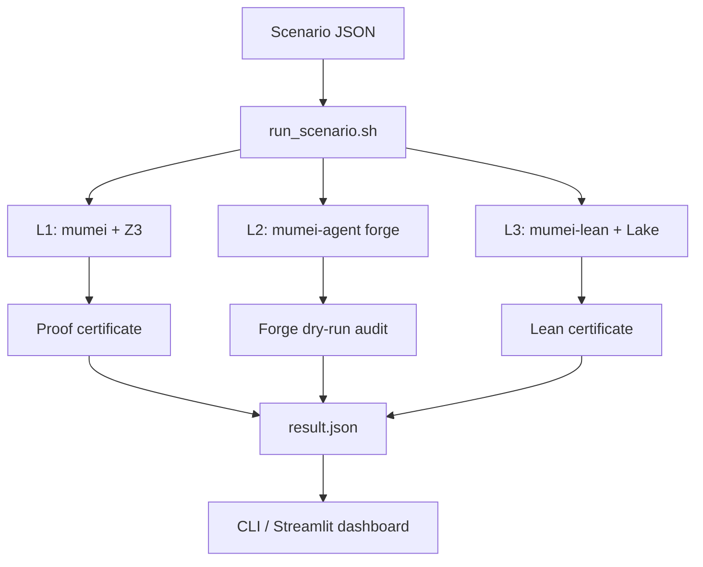

# Mumei Secure Verification Demo

`mumei-demo` is the integration demo workspace for the Mumei secure verification
stack. It coordinates three repositories:

- [mumei-lang/mumei](https://github.com/mumei-lang/mumei): L1 Z3-backed
  contract and effect verification.
- [mumei-lang/mumei-agent](https://github.com/mumei-lang/mumei-agent): L2 agent
  forge workflows for verified standard-library growth.
- [mumei-lang/mumei-lean](https://github.com/mumei-lang/mumei-lean): L3 Lean
  proof bridge for obligations that need theorem-prover certification.

The first scenario is the Phase 1 Ownership Transfer Protocol demo, proving that
a contract cannot reach `Transferred` without a valid `accept`.



## Quick start

```bash
./scripts/setup_repos.sh
./scripts/run_scenario.sh ownership_transfer
python dashboard/cli_report.py reports/ownership_transfer/latest/result.json
```

If the repositories are already checked out elsewhere, pass explicit paths:

```bash
./scripts/run_scenario.sh ownership_transfer \
  --mumei-repo ../mumei \
  --mumei-lean-repo ../mumei-lean \
  --mumei-agent-repo ../mumei-agent \
  --mumei-bin ../mumei/target/release/mumei
```

## Adding scenarios

Copy `scenarios/_template/` and edit `scenario.json`. Two-layer demos can use
`"layers": ["l1_z3", "l2_agent"]`; three-layer demos add `"l3_lean"`.

See [docs/SCENARIO_SPEC.md](docs/SCENARIO_SPEC.md) for the scenario schema and
[docs/DEMO_GUIDE.md](docs/DEMO_GUIDE.md) for detailed setup, execution, and
dashboard usage.