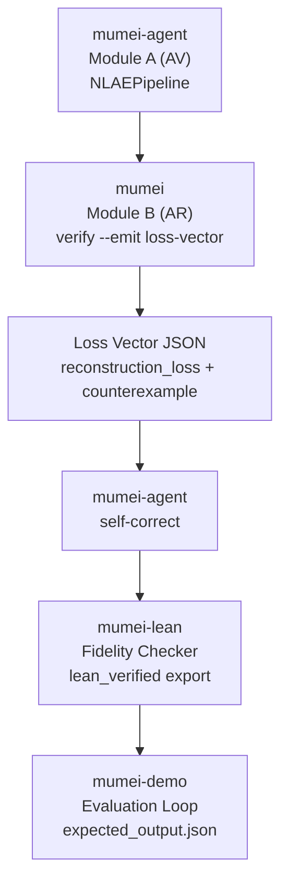

# Mumei Demo

> **Mumei proves that LLM-generated code has bugs — mathematically.**

## The Problem

LLMs write code that looks correct but contains subtle bugs.  
Formal verification checks **every possible case** before the bug becomes a
production incident.

Mumei's demo scenarios make those bugs concrete:

| Scenario | Bug an LLM can miss | How Mumei catches it |
| --- | --- | --- |
| Ownership Transfer | `hostile_takeover` skips `accept` and tries `Idle → Transferred`. | The effect checker rejects the invalid pre-state with `InvalidPreState`. |
| RTGS Settlement | A transfer flow can break balance conservation or settle before validation. | Z3 checks settlement contracts, then Lean certifies deeper invariants when available. |
| RegTech Compliance | `PEP` customers are missing from a `match` expression. | Exhaustiveness checking reports `CustomerType::PEP (tag=3)` as a counter-example. |
| NL → Verified | Requirements start as natural language instead of verified code. | The agent extracts a spec, generates `.mm`, and Z3 verifies the result automatically. |
| Medical Device Control | An insulin pump skips hourly dosage safety checks. | Z3 catches the invalid delivery state, then optional Lean proof certifies cumulative dosage safety. |
| Aviation Control | Runway allocation has inconsistent lock ordering. | Z3 verifies ordered allocation, and the agent validates the generation task. |
| Merkle Tree Verification | Assumes hash function integrity without proof | Z3 verifies `hash_function_secure` precondition, Lean certifies collision resistance |
| DeFi Invariant | Integer overflow in ERC-20 transfer | Refinement types (`type Uint256 = i64 where v >= 0 && v <= MAX`) prevent overflow at compile time |
| ArkLib-Style Audit | Complex implementation hides bugs | Top-level `requires`/`ensures` reviewed by humans, Lean proves implementation correctness |
| P9-G NLAE Integration | A generated vault withdrawal violates a postcondition | `mumei verify --emit loss-vector` feeds mumei-agent self-correction, then mumei-lean checks fidelity |

## How It Works

Mumei is a proof-driven programming language where verification is automatic.
You write `requires` / `ensures` constraints in familiar syntax — the rest is
handled by a unified proof pipeline.

```text
mumei contract
      ↓
Z3 (automatic, fast)
      ↓
Lean 4 (deep proof)
      ↓
AI agent (self-heal)
```

One language. One contract syntax. Multiple proof engines — escalating
automatically from fast (Z3) to deep (Lean 4) to autonomous (AI agent).

What makes this possible:

| You write | mumei does |
| --- | --- |
| `requires: balance >= amount;` | Turns preconditions into solver obligations before code runs |
| `ensures: result == old(balance) - amount;` | Checks postconditions against every possible execution path |
| `requires: state == PendingTransfer;` | Rejects invalid temporal state transitions at compile time |
| `ensures: total_before == total_after;` | Escalates deeper invariants through the proof certificate chain |

The key insight: mumei is the contract language that all proof engines share.
Z3 and Lean 4 are not alternatives — they are layers in the same pipeline,
connected by a Proof Certificate Chain that flows automatically.

## See It In Action

```text
LLM generates code
      ↓
mumei verifies (Z3 — automatic)
      ↓
  ✅ Proven safe        ❌ Counter-example found
      ↓                       ↓
  LLVM binary           AI agent fixes & retries
      ↓
  Lean 4 certifies properties beyond Z3's reach
```

### ❌ Without Mumei

```text
User: "Implement ownership transfer"
LLM:  Generates code that skips the accept step
      → Deployed to production
      → Attacker takes over the contract
```

### ✅ With Mumei

```text
User: "Implement ownership transfer"
LLM:  Generates code that skips the accept step
mumei: ❌ InvalidPreState: 'accept' requires 'PendingTransfer'
       but current state is 'Idle'
       Counter-example: hostile_takeover(attacker=42)
       → Bug caught at compile time. Zero damage.
```

## Demo showcase

- for user

https://github.com/user-attachments/assets/a7ac51f6-9b8a-4134-93f1-8d47492eefb6

- for developer

https://github.com/user-attachments/assets/58028a7c-252d-4ec0-bb5a-87bb03b5a7d0

Watch the recorded Ownership Transfer dashboard walkthrough in
[docs/DEMO_SHOWCASE.md](docs/DEMO_SHOWCASE.md), or open the video file directly:
[`docs/assets/ownership-transfer-dashboard-demo.mp4`](docs/assets/ownership-transfer-dashboard-demo.mp4).

The Phase 2 RTGS Settlement demo is complete. Its dashboard walkthrough is
available in
[docs/DEMO_SHOWCASE.md](docs/DEMO_SHOWCASE.md), or open the video directly:
[`docs/assets/rtgs-settlement-dashboard-demo.mp4`](docs/assets/rtgs-settlement-dashboard-demo.mp4).

The Phase 3 RegTech Compliance dashboard walkthrough shows Z3 catching a
missing `PEP` match arm and the 2-layer Z3 + Agent report:
[`docs/assets/regtech-compliance-dashboard-demo.mp4`](docs/assets/regtech-compliance-dashboard-demo.mp4).

The P11 Natural Language to Verified Mumei walkthrough shows Japanese
requirements converted to forge task spec JSON, generated `.mm`, and final Z3
verification:
[`docs/assets/nl-to-verified-dashboard-demo.mp4`](docs/assets/nl-to-verified-dashboard-demo.mp4).
For developers who prefer terminal output, the companion CLI walkthrough shows
the same scenario as an execution log with each extraction, generation, and
verification step:
[`docs/assets/nl-to-verified-cli-demo.mp4`](docs/assets/nl-to-verified-cli-demo.mp4).

The Medical Device Control scenario added in PR #28 demonstrates CI-ready
`l1_z3` + `l3_lean` validation for insulin pump safety: Z3 rejects invalid pump
states and Lean certifies cumulative dosage safety. Run it with `make demo-medical`
and inspect `reports/medical_device/latest/`.

The Phase 4-6 scenarios are implemented as CI-ready `l1_z3` + `l3_lean`
validations:

- Phase 4 Merkle Tree Verification: Z3 rejects missing `hash_function_secure`
  assumptions, then verifies the collision-resistance contract.
- Phase 5 DeFi Invariant: Z3 rejects unchecked ERC-20 receiver overflow, then
  verifies `Uint256` transfer bounds.
- Phase 6 ArkLib-Style Audit: Z3 rejects contradictory top-level theorem
  requirements, then verifies the reviewed audit theorem and proof certificate.

The scenario harness is documented as an NLAH-style artifact contract in
[`docs/HARNESS_CONTRACTS.md`](docs/HARNESS_CONTRACTS.md). Each
`scenario.json` maps its Z3, agent, and Lean gates to the evidence written in
`result.json`, `report.md`, proof certificates, Lean certificates, and dashboard
summaries.

## P9-G NLAE Integration Demo

The P9-G demo connects all four repositories as NLAE components:



Run it from this repository after placing sibling checkouts at `../mumei`,
`../mumei-agent`, and `../mumei-lean`:

```bash
./demos/nlae_integration/run_demo.sh
```

Or provide explicit paths:

```bash
MUMEI_REPO=../mumei \
MUMEI_AGENT_REPO=../mumei-agent \
MUMEI_LEAN_REPO=../mumei-lean \
./demos/nlae_integration/run_demo.sh
```

The harness is deterministic by default: fixture clients exercise
`NLAEPipeline`, Loss Vector routing, self-correction, and Lean fidelity checking
without requiring live LLM credentials or a live Lean build. If
`$MUMEI_REPO/target/debug/mumei` exists, the script also captures the live
`--emit loss-vector` output under `demos/nlae_integration/.work/`.

## Quick Start

Prepare sibling checkouts and run the integrated demo sequence:

```bash
make setup && make demo
```

`make setup` clones or refreshes `mumei`, `mumei-agent`, and `mumei-lean` next
to this repository. `make demo` then runs the complete ten-scenario
presentation sequence from `Makefile`'s `SCENARIOS` variable, integrates the
Phase 1-6 demos, and writes reports under `reports/<scenario>/latest/` plus
dashboard summaries.

For CI-equivalent validation with fixture mode and dashboard summaries:

```bash
make demo-ci
```

## Run Individual Scenarios

For the Phase 1 Ownership Transfer scenario:

```bash
make demo-ownership
```

For the RTGS Settlement scenario:

```bash
make demo-settlement
```

For the RegTech Compliance scenario:

```bash
make demo-regtech
```

For the Natural Language to Verified Mumei scenario, provide `OPENAI_API_KEY`
for the Step 0 spec extraction and run:

```bash
make demo-nl
```

For the Medical Device Control scenario:

```bash
make demo-medical
```

For the Merkle Tree Verification scenario:

```bash
make demo-merkle
```

For the DeFi Invariant scenario:

```bash
make demo-defi
```

For the ArkLib-Style Audit scenario:

```bash
make demo-arklib
```

For the P9-G NLAE Integration demo:

```bash
./demos/nlae_integration/run_demo.sh
```

To run the complete ten-scenario integrated demo sequence:

```bash
make demo
```

`make demo-all` remains as a compatibility alias for `make demo`.

For CI-equivalent validation with a dashboard summary:

```bash
make demo-ci
```

Each scenario run writes `harness_contract_compliance` into
`reports/<scenario>/latest/result.json`. `make demo-nl` prints the compliance
status, `report.md` renders the checklist, and the dashboard summary shows the
same compliance value across scenarios.

## Scenario Examples

### Ownership Transfer

```text
$ make demo-ownership
l1_z3/detect_bug: REJECTED
❌ BUG DETECTED!
  InvalidPreState: 'accept' requires 'PendingTransfer'
  but current state is 'Idle'
l1_z3/verify_correct: PASS
l1_z3/verify_e2e: PASS
l2_agent/forge_dryrun: PASS
l3_lean/lean_build: CERTIFIED
Proof Density: 100% (6/6 atoms)
```

### RTGS Settlement

```text
$ make demo-settlement
l1_z3/detect_bug: REJECTED
❌ BUG DETECTED!
  InvalidPreState: 'settle' requires 'Validated'
  but current state is 'Pending'
l1_z3/verify_correct: PASS
l1_z3/verify_e2e: PASS
l2_agent/forge_dryrun: PASS
l3_lean/lean_build: CERTIFIED
Proof Density: 100% (6/6 atoms)
```

### RegTech Compliance

```text
$ make demo-regtech
l1_z3/detect_bug: REJECTED
❌ BUG DETECTED!
  Match is not exhaustive:
  Counter-example: CustomerType::PEP (tag=3)
l1_z3/verify_negative_suite: REJECTED
l1_z3/verify_correct: PASS
l1_z3/verify_e2e: PASS
l2_agent/forge_dryrun: PASS
Proof Density: 100% (5/5 atoms)
```

✅ **Phase 3 Completed**: Z3-only 2層検証デモとして完成。forall 量化子と match 網羅性による規制遵守保証を実証。

### Natural Language → Verified Mumei

```text
$ make demo-nl
l2_agent/extract_spec: PASS
l2_agent/generate_code: PASS
l1_z3/verify_code: PASS
✅ DEMO COMPLETE: Natural language specification verified
Proof Density: 100% (3/3 atoms)
```

## What Runs

`make demo-ownership` executes the Phase 1 Ownership Transfer Protocol scenario:

1. LLM-generated `hostile_takeover` code tries to reach `Transferred` from `Idle`.
2. `mumei verify` rejects it with `InvalidPreState` — Z3 proves the state violation.
3. The corrected implementation verifies all five ownership atoms with Z3.
4. Lean 4 certifies `no_transfer_without_accept` through the proof certificate chain (when available).

`make demo` runs the complete ten-scenario integrated demo sequence:

1. Phase 1 Ownership Transfer Protocol.
2. Phase 2 RTGS Settlement Protocol.
3. Phase 3 RegTech Compliance Protocol.
4. P11 Natural Language to Verified Mumei.
5. Smart Contract Audit.
6. Medical Device Control.
7. Aviation Control.
8. Phase 4 Merkle Tree Verification.
9. Phase 5 DeFi Invariant.
10. Phase 6 ArkLib-Style Audit.

It also generates `dashboard/summary.md` and `dashboard/highlights.md` from the
latest scenario outputs. `make demo-all` remains an alias for the same integrated
sequence.

`make demo-settlement` executes the Phase 2 RTGS Settlement Protocol scenario:

1. LLM-generated `hostile_settlement` code tries to reach `Settled` from `Pending`.
2. `mumei verify` rejects it with `InvalidPreState` — Z3 proves the state violation.
3. The corrected implementation verifies all four settlement atoms with Z3.
4. `mumei-lean` certifies `no_settlement_without_validate` and balance conservation when Lean is available.

`make demo-regtech` executes the Phase 3 RegTech Compliance Protocol scenario:

1. LLM-generated KYC code omits the `PEP` customer category from a `match`.
2. `mumei verify` rejects it with `Match is not exhaustive` and
   `CustomerType::PEP (tag=3)`.
3. The negative test suite confirms the missing `PEP` match arm is rejected.
4. The corrected implementation verifies all five compliance atoms with Z3,
   including `forall`-based transaction-limit checks.
5. The Agent forge dry-run validates the RegTech generation task. This scenario
   intentionally has no Lean layer because Z3 covers match exhaustiveness and
   quantifier checks for the demo.

`make demo-nl` executes the P11 Natural Language to Verified Mumei scenario:

1. Japanese natural-language bank-transfer requirements are extracted into a
   forge task spec JSON.
2. `mumei-agent generate` turns the extracted spec into `generated.mm`.
3. `mumei verify` proves the generated `secure_transfer` atom with Z3.
4. The latest E2E run produced `l2_agent/extract_spec: PASS`,
   `l2_agent/generate_code: PASS`, `l1_z3/verify_code: PASS`, and
   `Proof Density: 100% (3/3 atoms)`.
5. The CLI recording at
   [`docs/assets/nl-to-verified-cli-demo.mp4`](docs/assets/nl-to-verified-cli-demo.mp4)
   shows the developer-facing command flow and PASS log.

`make demo-medical` executes the Medical Device Control scenario:

1. A buggy insulin pump delivery path skips the hourly safety gate.
2. `mumei verify` rejects the invalid delivery state before dosage is applied.
3. The corrected controller verifies Z3 safety constraints for allowed pump states.
4. The Lean layer certifies cumulative dosage safety when `lake` and its proof
   module are available.
5. The scenario is included in `make demo`, `make demo-all`, and `make demo-ci`.

`make demo-merkle` executes the Merkle Tree Verification scenario:

1. A buggy Merkle verifier accepts a path computation without requiring
   `hash_function_secure`.
2. `mumei verify` rejects the unbound root proof with an unsatisfied
   postcondition.
3. The corrected contract requires the security flag plus
   `leaf + sibling_hash == expected_root` and verifies with Z3.
4. The optional Lean layer targets `MumeiLean.MerkleTree` when available.
5. The scenario is included in `make demo`, `make demo-all`, and `make demo-ci`.

`make demo-defi` executes the DeFi Invariant scenario:

1. A buggy ERC-20 transfer calls a `Uint256` checker without proving the
   receiver-side upper bound.
2. `mumei verify` rejects the missing precondition as a boundary violation.
3. The corrected `safe_transfer` requires `to_balance + amount <= MAX` and
   verifies the refined `Uint256` result with Z3.
4. The optional Lean layer targets `MumeiLean.DeFi` when available.
5. The scenario is included in `make demo`, `make demo-all`, and `make demo-ci`.

`make demo-arklib` executes the ArkLib-Style Audit scenario:

1. A buggy top-level theorem requires commitments to be both equal and unequal.
2. `mumei verify` rejects the contradictory `requires` clauses.
3. The corrected theorem binds the pre/post/invariant hash to the expected
   implementation commitment and verifies with Z3.
4. The optional Lean layer targets `MumeiLean.ArkLibAudit` when available.
5. The scenario is included in `make demo`, `make demo-all`, and `make demo-ci`.

## What Mumei Adds to the Pipeline

```mumei
atom increment(counter: i64) -> i64 {
    requires: counter >= 0;
    ensures: result == counter + 1;
    ensures: result > counter;
    body: {
        return counter + 1;
    }
}
```

- **Refinement types**: attach logical predicates directly to values and APIs.
- **Effect safety**: prove side effects are allowed before code reaches runtime.
- **Temporal state machines**: reject invalid state transitions like
  `Idle → Transferred`.
- **AI-native**: return solver counter-examples that an agent can use to repair
  the code.

One contract language drives automatic checks, counter-example feedback, and
deeper proof certification.

## Three-Layer Architecture

| Layer | Repository | Role |
| --- | --- | --- |
| L1 | `mumei` + Z3 | Automatic contract & effect verification |
| L2 | `mumei-agent` | AI-driven self-healing |
| L3 | `mumei-lean` + Lean 4 | Deep proof backend for auto-escalation from Z3 |

L1 handles fast automatic verification. L3 extends the same contract pipeline
through the proof certificate chain. Some scenarios, such as RegTech Compliance,
intentionally stop at L1 + L2 when Z3 fully proves the relevant properties.

## Scenario Harness Contracts

Scenarios include NLAH-style `harness_contract` metadata, top-level
`intent_fidelity`, and per-step `harness_stage`, `artifact_contract`,
`verifier_gate`, and `failure_taxonomy` fields. The runner copies these fields
into `result.json`, and reports render them as evidence without changing command
execution.

Use this to make each demo explicit about:

- which layer sequence is the acceptance path,
- which files are persistent artifacts,
- which verifier gate accepts or rejects each step, and
- which failure class is intentionally demonstrated,
- how `result.json`, `report.md`, proof certificates, Lean certificates, and
  dashboard summaries map back to the original scenario intent.

See `docs/HARNESS_CONTRACTS.md`, `docs/SCENARIO_SPEC.md`, and
`scenarios/_template/scenario.json` for the schema and copyable defaults.

## Repositories

- [mumei-lang/mumei](https://github.com/mumei-lang/mumei): Contract language + Z3 automatic verification.
- [mumei-lang/mumei-agent](https://github.com/mumei-lang/mumei-agent): AI-driven self-healing loop.
- [mumei-lang/mumei-lean](https://github.com/mumei-lang/mumei-lean): Lean 4 deep proof backend (auto-escalation from Z3).

## Advanced usage

If the repositories are already checked out elsewhere, pass explicit paths:

```bash
./scripts/run_scenario.sh ownership_transfer \
  --mumei-repo ../mumei \
  --mumei-lean-repo ../mumei-lean \
  --mumei-agent-repo ../mumei-agent \
  --mumei-agent-python ../mumei-agent/.venv/bin/python \
  --mumei-bin ../mumei/target/release/mumei
```

## Adding scenarios

Copy `scenarios/_template/` and edit `scenario.json`. Two-layer demos can use
`"layers": ["l1_z3", "l2_agent"]`; three-layer demos add `"l3_lean"`.

See [docs/SCENARIO_SPEC.md](docs/SCENARIO_SPEC.md) for the scenario schema and
[docs/DEMO_GUIDE.md](docs/DEMO_GUIDE.md) for detailed setup, execution, and
dashboard usage.
