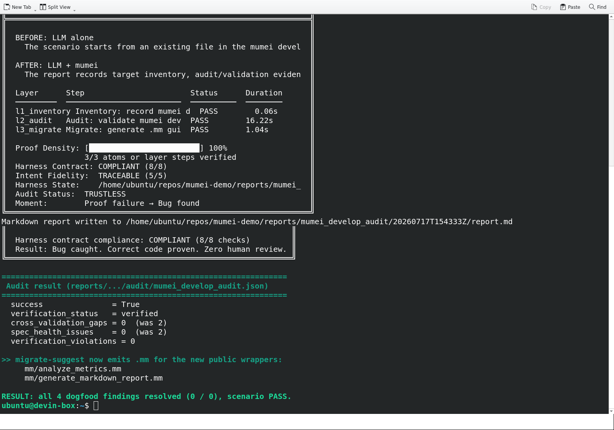

# Demo Showcase

## Ownership Transfer Protocol

This walkthrough shows the Phase 1 Ownership Transfer Protocol scenario in the
Streamlit dashboard after running `./scripts/run_scenario.sh ownership_transfer`.

<video controls src="./assets/ownership-transfer-dashboard-demo.mp4" title="Ownership Transfer dashboard walkthrough"></video>

If the embedded player is unavailable, open the video directly:
[`docs/assets/ownership-transfer-dashboard-demo.mp4`](assets/ownership-transfer-dashboard-demo.mp4).

The recording highlights:

- `ownership_transfer` selected in the sidebar.
- L1/L2/L3 layer status cards all reporting `PASS`.
- Proof density at `100% (6/6 atoms)`.
- The hostile takeover step rejected with `Temporal effect violation (InvalidPreState)`.
- `ownership.proof.json` displayed in the proof certificate viewer.

## RTGS Settlement Protocol

This walkthrough shows the Phase 2 RTGS Settlement Protocol scenario in the
Streamlit dashboard after running `make demo-settlement`.

<video controls src="./assets/rtgs-settlement-dashboard-demo.mp4" title="RTGS Settlement dashboard walkthrough"></video>

If the embedded player is unavailable, open the video directly:
[`docs/assets/rtgs-settlement-dashboard-demo.mp4`](assets/rtgs-settlement-dashboard-demo.mp4).

The recording highlights:

- `rtgs_settlement` selected in the sidebar.
- L1/L2/L3 layer status cards all reporting `PASS`.
- Proof density at `100% (6/6 atoms)`.
- The hostile settlement step rejected with `Temporal effect violation (InvalidPreState)`.
- `settlement.proof.json` and `settlement.lean-cert.json` displayed in the proof certificate viewer.

## RegTech Compliance Protocol

This walkthrough shows the Phase 3 RegTech Compliance Protocol scenario in the
Streamlit dashboard after running `make demo-regtech`.

<video controls src="./assets/regtech-compliance-dashboard-demo.mp4" title="RegTech Compliance dashboard walkthrough"></video>

If the embedded player is unavailable, open the video directly:
[`docs/assets/regtech-compliance-dashboard-demo.mp4`](assets/regtech-compliance-dashboard-demo.mp4).

The recording highlights:

- `regtech_compliance` selected in the sidebar.
- L1/L2 layer status cards reporting `PASS`; no L3/Lean layer is present.
- Proof density at `100% (4/4 atoms)`.
- The buggy KYC classifier rejected with `Match is not exhaustive`.
- The Z3 counter-example `CustomerType::PEP (tag=3)` displayed in step logs.
- `compliance.proof.json` displayed in the proof certificate viewer.

## Natural Language to Verified Mumei

This walkthrough shows the P11 Natural Language to Verified Mumei scenario in
the Streamlit dashboard after running `make demo-nl` with `OPENAI_API_KEY`
configured for Step 0 spec extraction.

<video controls src="./assets/nl-to-verified-dashboard-demo.mp4" title="Natural Language to Verified Mumei dashboard walkthrough"></video>

If the embedded player is unavailable, open the video directly:
[`docs/assets/nl-to-verified-dashboard-demo.mp4`](assets/nl-to-verified-dashboard-demo.mp4).

The recording highlights:

- `nl_to_verified` selected in the sidebar.
- L2 Agent and L1 Z3 layer status cards reporting `PASS`.
- Proof density at `100% (3/3 atoms)`.
- `PASS: Agent Spec Extraction` producing `extracted_spec.json`.
- `PASS: Agent Code Generation` producing `generated.mm`.
- `PASS: Z3 Generated Code Verification` with `Verification passed` in the log.

### CLI execution walkthrough

The companion CLI recording is aimed at developers who want to follow the
terminal-first execution flow from scenario command to final proof report.

<video controls src="./assets/nl-to-verified-cli-demo.mp4" title="Natural Language to Verified Mumei CLI walkthrough"></video>

If the embedded player is unavailable, open the CLI video directly:
[`docs/assets/nl-to-verified-cli-demo.mp4`](assets/nl-to-verified-cli-demo.mp4).

The CLI recording highlights:

- The `nl_to_verified` scenario command with `OPENAI_API_KEY`, `MUMEI_BIN`, and
  repo paths configured.
- `extract_spec` writing `extracted_spec.json`.
- `generate_code` writing `generated.mm`.
- `mumei verify` proving the generated `secure_transfer` atom.
- The final CLI report with all three PASS lines and proof density.

Latest E2E evidence:

```text
l2_agent/extract_spec: PASS
l2_agent/generate_code: PASS
l1_z3/verify_code: PASS
Proof Density: 100% (3/3 atoms)
Result: Bug caught. Correct code proven. Zero human review.
```

## Medical Device Control

This walkthrough covers the PR #28 Medical Device Control scenario after running
`make demo-medical` or the CI fixture equivalent `CI_FIXTURE_MODE=1 make demo-ci`.
It is a safety-critical insulin pump demo with `l1_z3` contract verification and
an optional `l3_lean` proof step.

No dedicated video artifact is checked in yet. When captured, place it under
`docs/assets/medical-device-dashboard-demo.mp4` and embed it here with the same
pattern as the other dashboard recordings.

Expected dashboard evidence:

- `medical_device` selected in the sidebar.
- L1 Z3 layer rejects the buggy delivery path before dosage is applied.
- The corrected controller verifies pump-state and hourly dosage constraints.
- L3 Lean reports `CERTIFIED` for cumulative dosage safety when `lake` is available.
- `reports/medical_device/latest/result.json` and the dosage proof certificate are visible in the report viewer.

Latest CI-oriented evidence:

```text
l1_z3/detect_bug: REJECTED
l1_z3/verify_correct: PASS
l3_lean/lean_build: CERTIFIED or SKIPPED when lake is unavailable
Result: Invalid delivery state caught before unsafe dosage.
```

## Mumei Develop Audit (dogfooding verification)

This CLI walkthrough re-runs the `mumei_develop_audit` scenario in live mode
after the dogfooding fixes (mumei #432, mumei-agent #377, mumei-demo #66). The
scenario applies `mumei-agent audit` to `mumei/scripts/generate_stdlib_metrics.py`
and proves that the four audit findings from `AUDIT_LOG_2026-06-21.md` are gone.

<video controls src="./assets/mumei-develop-audit-cli-demo.mp4" title="Mumei Develop Audit live re-run"></video>

If the embedded player is unavailable, open the video directly:
[`docs/assets/mumei-develop-audit-cli-demo.mp4`](assets/mumei-develop-audit-cli-demo.mp4).

Final result screenshot:



The recording highlights:

- `l1_inventory/record_targets: PASS`, `l2_audit/audit_develop_target: PASS`,
  `l3_migrate/generate_migration_guidance: PASS`.
- `success = True`, `verification_status = verified`.
- `cross_validation_gaps` `2 → 0` (the `analyze_metrics` /
  `generate_markdown_report` wrappers now map to spec atoms).
- `spec_health_issues` `2 → 0` (the `directory_path.endsWith('/std/')` and
  `result == true` encoding gaps are lowered instead of failing).
- `verification_violations = 0`.
- `migrate-suggest` emits `mm/analyze_metrics.mm` and
  `mm/generate_markdown_report.mm` for the new public wrappers.

See [`scenarios/mumei_develop_audit/AUDIT_LOG_2026-07-17.md`](../scenarios/mumei_develop_audit/AUDIT_LOG_2026-07-17.md)
for the before/after audit-field comparison.

## Ownership Transfer Protocol — PR #2 E2E Recording

This recording shows the redesigned demo flow using artifacts generated by
`MUMEI_BIN=/home/ubuntu/repos/mumei/target/debug/mumei make demo-ownership`.

<video controls src="./assets/ownership-transfer-cli-demo.mp4" title="Ownership Transfer PR #2 E2E dashboard walkthrough"></video>

If the embedded player is unavailable, open the video directly:
[`docs/assets/ownership-transfer-cli-demo.mp4`](assets/ownership-transfer-cli-demo.mp4).

The recording highlights:

- `ownership_transfer` selected in the sidebar.
- L1/L2/L3 layer status cards all reporting `PASS`.
- Proof density at `100% (6/6 atoms)`.
- The hostile takeover step rejected with `Temporal effect violation (InvalidPreState)`.
- `ownership.proof.json` displayed with verified atom data.

## Verification demo: dogfooding audit

The `mumei_develop_audit` scenario points Mumei's own audit tooling at
`mumei/scripts/generate_stdlib_metrics.py`. After the dogfooding fixes (mumei
#432, mumei-agent #377, mumei-demo #66), a live re-run shows all four original
audit findings resolved:

- all three layers PASS (`record_targets`, `audit_develop_target`,
  `generate_migration_guidance`);
- `success = True`, `verification_status = verified`;
- `cross_validation_gaps` `2 → 0` and `spec_health_issues` `2 → 0`;
- `migrate-suggest` emits `mm/analyze_metrics.mm` and
  `mm/generate_markdown_report.mm`.

Recording and result screenshot:
[`docs/DEMO_SHOWCASE.md#mumei-develop-audit-dogfooding-verification`](#mumei-develop-audit-dogfooding-verification)
— video [`docs/assets/mumei-develop-audit-cli-demo.mp4`](assets/mumei-develop-audit-cli-demo.mp4),
image [`docs/assets/mumei-develop-audit-result.png`](assets/mumei-develop-audit-result.png).


Before/after audit fields:
[`scenarios/mumei_develop_audit/AUDIT_LOG_2026-07-17.md`](../scenarios/mumei_develop_audit/AUDIT_LOG_2026-07-17.md).
This scenario also illustrates the quality-gate principle documented in the
scenario README: spec health and cross-validation drift are first-class gates,
and a passing scenario does not by itself mean there is no audit follow-up.
