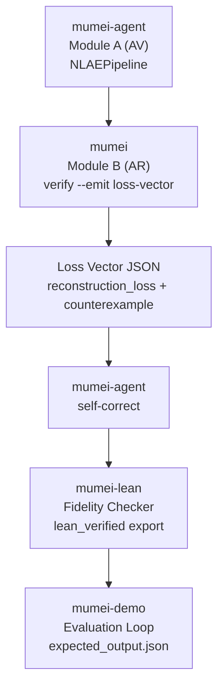

# Scenario Catalog

Detailed descriptions of every demo scenario. For run commands see
[`DEMO_GUIDE.md`](DEMO_GUIDE.md); for recorded walkthroughs see
[`DEMO_SHOWCASE.md`](DEMO_SHOWCASE.md).

## What each scenario proves

- **Phase 1 Ownership Transfer** — Z3 rejects a `hostile_takeover` that skips
  `accept` (`Idle → Transferred`) with `InvalidPreState`; Lean certifies
  `no_transfer_without_accept` when available.
- **Phase 2 RTGS Settlement** — Z3 rejects settling before validation and
  Lean certifies `no_settlement_without_validate` plus balance conservation
  when available.
- **Phase 3 RegTech Compliance** — a 2-layer Z3 + Agent demo. Z3 catches a
  missing `PEP` match arm (`CustomerType::PEP (tag=3)`) and verifies
  `forall`-based transaction-limit checks. No Lean layer by design.
- **P11 Natural Language → Verified** — Japanese requirements are extracted to a
  forge task spec, `mumei-agent generate` emits `.mm`, and Z3 verifies the
  result.
- **No-.mm Multi-language Audit** — Python/Rust/TypeScript/Go code is audited
  before any `.mm` exists. All four languages share the same
  `spec_health_issues` / `verification_violations` / `cross_validation_gaps` /
  `next_steps` / `migration_hints` / `healed_files` / `heal_errors` keys;
  language selection only changes the parser route.
- **Phase 7 Spec-Code Verification Suite** — the V1-E-4 no-`.mm` front door. One
  fixture-safe flow runs `mode_a` (V1-A spec health), `mode_b` (V1-B
  existing-code audit), `mode_c` (V1-C spec→code conformance), and `mode_d`
  (V1-D code→spec drift). `next_steps` is the only human-review entrypoint.
- **Mumei Develop Audit** — dogfooding: `mumei-agent audit` is applied to
  `mumei/scripts/generate_stdlib_metrics.py`. See
  [`../scenarios/mumei_develop_audit/README.md`](../scenarios/mumei_develop_audit/README.md)
  and the [showcase recording](DEMO_SHOWCASE.md#mumei-develop-audit-dogfooding-verification).
- **Medical Device Control** — Z3 rejects an insulin pump path that skips the
  hourly safety gate; Lean certifies cumulative dosage safety when available.
- **Merkle Tree Verification** — Z3 rejects a path computation that omits
  `hash_function_secure`, then verifies the collision-resistance contract.
- **DeFi Invariant** — Z3 rejects an unchecked ERC-20 receiver overflow, then
  verifies `Uint256` transfer bounds (`to_balance + amount <= MAX`).
- **ArkLib-Style Audit** — Z3 rejects a contradictory top-level theorem, then
  verifies the reviewed audit theorem and proof certificate.
- **Aviation Control** — Z3 verifies ordered runway allocation and the agent
  validates the generation task.
- **P9-G NLAE Integration** — connects all four repos: a generated vault
  withdrawal that violates a postcondition drives `mumei verify --emit
  loss-vector` → mumei-agent self-correction → mumei-lean fidelity check.

## Scenario output examples

### Ownership Transfer

```text
$ make demo-ownership
l1_z3/detect_bug: REJECTED
❌ BUG DETECTED!
  InvalidPreState: 'accept' requires 'PendingTransfer'
  but current state is 'Idle'
l1_z3/verify_correct: PASS
l1_z3/verify_e2e: PASS
l2_agent/forge_dryrun: PASS
l3_lean/lean_build: CERTIFIED
Proof Density: 100% (6/6 atoms)
```

### RTGS Settlement

```text
$ make demo-settlement
l1_z3/detect_bug: REJECTED
❌ BUG DETECTED!
  InvalidPreState: 'settle' requires 'Validated'
  but current state is 'Pending'
l1_z3/verify_correct: PASS
l1_z3/verify_e2e: PASS
l2_agent/forge_dryrun: PASS
l3_lean/lean_build: CERTIFIED
Proof Density: 100% (6/6 atoms)
```

### RegTech Compliance

```text
$ make demo-regtech
l1_z3/detect_bug: REJECTED
❌ BUG DETECTED!
  Match is not exhaustive:
  Counter-example: CustomerType::PEP (tag=3)
l1_z3/verify_negative_suite: REJECTED
l1_z3/verify_correct: PASS
l1_z3/verify_e2e: PASS
l2_agent/forge_dryrun: PASS
Proof Density: 100% (5/5 atoms)
```

### Natural Language → Verified Mumei

```text
$ make demo-nl
l2_agent/extract_spec: PASS
l2_agent/generate_code: PASS
l1_z3/verify_code: PASS
✅ DEMO COMPLETE: Natural language specification verified
Proof Density: 100% (3/3 atoms)
```

## Step-by-step: what runs

`make demo-ownership` (Phase 1 Ownership Transfer Protocol):

1. LLM-generated `hostile_takeover` code tries to reach `Transferred` from `Idle`.
2. `mumei verify` rejects it with `InvalidPreState` — Z3 proves the state violation.
3. The corrected implementation verifies all five ownership atoms with Z3.
4. Lean 4 certifies `no_transfer_without_accept` through the proof certificate
   chain (when available).

`make demo-settlement` (Phase 2 RTGS Settlement Protocol):

1. LLM-generated `hostile_settlement` code tries to reach `Settled` from `Pending`.
2. `mumei verify` rejects it with `InvalidPreState` — Z3 proves the state violation.
3. The corrected implementation verifies all four settlement atoms with Z3.
4. `mumei-lean` certifies `no_settlement_without_validate` and balance
   conservation when Lean is available.

`make demo-regtech` (Phase 3 RegTech Compliance Protocol):

1. LLM-generated KYC code omits the `PEP` customer category from a `match`.
2. `mumei verify` rejects it with `Match is not exhaustive` and
   `CustomerType::PEP (tag=3)`.
3. The negative test suite confirms the missing `PEP` match arm is rejected.
4. The corrected implementation verifies all five compliance atoms with Z3,
   including `forall`-based transaction-limit checks.
5. The Agent forge dry-run validates the RegTech generation task. There is no
   Lean layer because Z3 covers match exhaustiveness and quantifier checks.

`make demo-nl` (P11 Natural Language to Verified Mumei):

1. Japanese natural-language bank-transfer requirements are extracted into a
   forge task spec JSON.
2. `mumei-agent generate` turns the extracted spec into `generated.mm`.
3. `mumei verify` proves the generated `secure_transfer` atom with Z3.
4. Latest E2E: `l2_agent/extract_spec: PASS`, `l2_agent/generate_code: PASS`,
   `l1_z3/verify_code: PASS`, `Proof Density: 100% (3/3 atoms)`.

`make demo-medical` (Medical Device Control):

1. A buggy insulin pump delivery path skips the hourly safety gate.
2. `mumei verify` rejects the invalid delivery state before dosage is applied.
3. The corrected controller verifies Z3 safety constraints for allowed pump states.
4. The Lean layer certifies cumulative dosage safety when `lake` and its proof
   module are available.

`make demo-merkle` (Merkle Tree Verification):

1. A buggy Merkle verifier accepts a path computation without requiring
   `hash_function_secure`.
2. `mumei verify` rejects the unbound root proof with an unsatisfied postcondition.
3. The corrected contract requires the security flag plus
   `leaf + sibling_hash == expected_root` and verifies with Z3.
4. The optional Lean layer targets `MumeiLean.MerkleTree` when available.

`make demo-defi` (DeFi Invariant):

1. A buggy ERC-20 transfer calls a `Uint256` checker without proving the
   receiver-side upper bound.
2. `mumei verify` rejects the missing precondition as a boundary violation.
3. The corrected `safe_transfer` requires `to_balance + amount <= MAX` and
   verifies the refined `Uint256` result with Z3.
4. The optional Lean layer targets `MumeiLean.DeFi` when available.

`make demo-arklib` (ArkLib-Style Audit):

1. A buggy top-level theorem requires commitments to be both equal and unequal.
2. `mumei verify` rejects the contradictory `requires` clauses.
3. The corrected theorem binds the pre/post/invariant hash to the expected
   implementation commitment and verifies with Z3.
4. The optional Lean layer targets `MumeiLean.ArkLibAudit` when available.

The Merkle, DeFi, ArkLib, and Medical Device scenarios are included in
`make demo`, `make demo-all`, and `make demo-ci`.

## P9-G NLAE Integration Demo

The P9-G demo connects all four repositories as NLAE components:



Run it after placing sibling checkouts at `../mumei`, `../mumei-agent`, and
`../mumei-lean`:

```bash
./demos/nlae_integration/run_demo.sh
```

Or provide explicit paths:

```bash
MUMEI_REPO=../mumei \
MUMEI_AGENT_REPO=../mumei-agent \
MUMEI_LEAN_REPO=../mumei-lean \
./demos/nlae_integration/run_demo.sh
```

The harness is deterministic by default: fixture clients exercise
`NLAEPipeline`, Loss Vector routing, self-correction, and Lean fidelity checking
without live LLM credentials or a live Lean build. If
`$MUMEI_REPO/target/debug/mumei` exists, the script also captures the live
`--emit loss-vector` output under `demos/nlae_integration/.work/`.

## Integrated demo sequence (`make demo`)

`make demo` runs every scenario in presentation order and regenerates
`dashboard/summary.md` and `dashboard/highlights.md`:

1. Phase 1 Ownership Transfer Protocol
2. Phase 2 RTGS Settlement Protocol
3. Phase 3 RegTech Compliance Protocol
4. P11 Natural Language to Verified Mumei
5. No-.mm Audit
6. Phase 7 Spec-Code Verification Suite
7. Mumei Develop Audit
8. Smart Contract Audit
9. Blockchain Audit
10. Medical Device Control
11. Aviation Control
12. Phase 4 Merkle Tree Verification
13. Phase 5 DeFi Invariant
14. Phase 6 ArkLib-Style Audit
15. Self-Correction Demo

`make demo-all` is a compatibility alias. Each run writes
`harness_contract_compliance` into `reports/<scenario>/latest/result.json`;
`report.md` renders the checklist and the dashboard summary shows the same
compliance value across scenarios.

## Scenario summary table

> **Mumei proves that LLM-generated code has bugs — mathematically.**

LLMs write code that looks correct but hides subtle bugs. Mumei runs formal
verification over **every possible case** before a bug becomes a production
incident. Each scenario below makes one of those bugs concrete and shows Mumei
catching it; per-scenario breakdowns follow in the sections above.

| Scenario | Bug an LLM can miss | How Mumei catches it |
| --- | --- | --- |
| Ownership Transfer | `hostile_takeover` skips `accept` and tries `Idle → Transferred`. | The effect checker rejects the invalid pre-state with `InvalidPreState`. |
| RTGS Settlement | A transfer flow can break balance conservation or settle before validation. | Z3 checks settlement contracts, then Lean certifies deeper invariants when available. |
| RegTech Compliance | `PEP` customers are missing from a `match` expression. | Exhaustiveness checking reports `CustomerType::PEP (tag=3)` as a counter-example. |
| NL → Verified | Requirements start as natural language instead of verified code. | The agent extracts a spec, generates `.mm`, and Z3 verifies the result automatically. |
| No-.mm Multi-language Audit | Existing Python/Rust/TypeScript/Go code enters before any `.mm` file exists. | The audit gate reports each language's violations as `verification_violations` with Z3 counterexamples and `next_steps`. |
| Phase 7 Spec-Code Verification Suite | A reviewer has only `spec.txt` and existing Python code, with no `.mm` entry yet. | V1-A through V1-D run in one flow: `spec_health_issues`, `verification_violations`, `traceability_matrix`, `drift_score`, and `next_steps`. |
| Mumei Develop Audit | The project's own tooling drifts from its spec. | Dogfooding: `mumei-agent audit` runs on `mumei/scripts/generate_stdlib_metrics.py`. |
| Medical Device Control | An insulin pump skips hourly dosage safety checks. | Z3 catches the invalid delivery state, then optional Lean proof certifies cumulative dosage safety. |
| Aviation Control | Runway allocation has inconsistent lock ordering. | Z3 verifies ordered allocation, and the agent validates the generation task. |
| Merkle Tree Verification | Assumes hash function integrity without proof. | Z3 verifies the `hash_function_secure` precondition, Lean certifies collision resistance. |
| DeFi Invariant | Integer overflow in ERC-20 transfer. | Refinement types (`type Uint256 = i64 where v >= 0 && v <= MAX`) prevent overflow at compile time. |
| ArkLib-Style Audit | Complex implementation hides bugs. | Top-level `requires`/`ensures` reviewed by humans, Lean proves implementation correctness. |
| P9-G NLAE Integration | A generated vault withdrawal violates a postcondition. | `mumei verify --emit loss-vector` feeds mumei-agent self-correction, then mumei-lean checks fidelity. |
