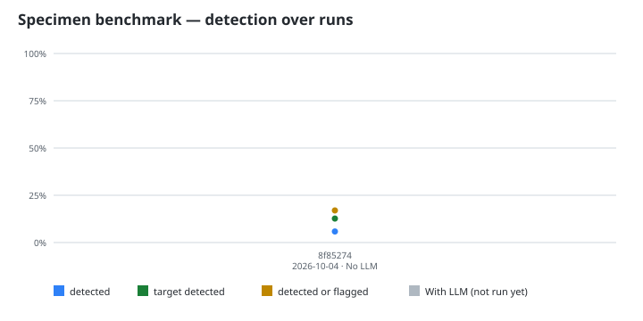

# Specimens: runnable apps with planted defects

This directory holds small, runnable applications and tools in several
languages. Each one works on its happy path but carries deliberately planted
bugs, design mistakes, and vulnerabilities. They exist so that Mumei
(`mumei-agent audit`, `migrate-suggest`, `heal`) and other analyzers can be
measured against a known ground truth.

**Do not deploy any of this code.** Servers bind to `127.0.0.1` only, secrets
are fake, and the Solidity contracts are only meant for a local Foundry test
run.

The corpus is a long-running benchmark: it intentionally includes defect
classes outside what the audit detects today, so the score has room to rise as
the tools improve. `scripts/run_specimen_audits.py` re-runs the audit after
Mumei/mumei-agent updates and records each run in
[`scoreboard/history.json`](scoreboard/history.json); the charts below are
rendered from it.

## Layout

```text
specimens/
  README.md              this file (conventions + catalog)
  DEFECTS.schema.json    JSON Schema for every DEFECTS.json
  <language>/
    <specimen-id>/
      README.md          what the app does and how to run it (no defect spoilers)
      DEFECTS.json       ground truth: every planted defect
      run.sh             runs the happy path; exits 0
      repro.sh           demonstrates every planted defect; exits 0 when all reproduce
      <source files>
      audit/             mumei-agent audit output (generated, see below)
```

Languages are the ones `mumei-agent audit` accepts: `python`, `typescript`,
`go`, `rust`, `solidity`.

Specimen ids are `<lang-prefix>-<NN>-<slug>`, with prefixes `py`, `ts`, `go`,
`rs`, `sol` (for example `py-03-ledger-api`). Defect ids are
`<SPECIMEN-PREFIX><NN>-D<NN>` (for example `PY03-D07`).

## Rules for specimen source code

- The source must look like ordinary code someone might ship. No comments or
  identifiers that point at the planted defects (`BUG`, `vuln`, `unsafe on
  purpose`, `intentionally`, `FIXME: overflow`, ...). The only ground truth is
  `DEFECTS.json`.
- The happy path really works: `run.sh` exits 0 and its output is sensible.
- Every defect is real and observable at runtime (or, for the few design
  defects that are only visible under concurrency or load, reproducible with a
  deterministic harness in `repro.sh`).
- Standard library only, so specimens run offline:
  - Python 3.10+ stdlib (`http.server`, `sqlite3`, `json`, `subprocess`, ...).
  - TypeScript runs directly with Node 22.6+ type stripping
    (`node --experimental-strip-types app.ts`; Node 23.6+ needs no flag). Use
    erasable syntax only: no `enum`, `namespace`, parameter properties, or
    decorators. No npm dependencies.
  - Go 1.22+ stdlib, one `go.mod` per specimen, no third-party modules.
  - Rust stable, one Cargo crate per specimen, no dependencies.
  - Solidity `^0.8.20` in a Foundry project per specimen (`foundry.toml`,
    `src/`, `test/`). Tests must not depend on `forge-std`; declare the few
    cheatcodes you need through a local `interface Vm` at
    `address(uint160(uint256(keccak256("hevm cheat code"))))`.
- Web servers listen on `127.0.0.1` and take the port from `PORT`
  (each specimen has a distinct default port; see the catalog). A `kind: web`
  specimen's README.md must contain a line `Default port: NNNN`, unique
  across specimens (checked by `scripts/check_specimens.py`).
- Files stay small enough for function-level audit: prefer many short
  functions over a few large ones. Roughly half of the defects in each
  specimen should sit in the classes Mumei's audit targets today (arithmetic
  overflow/underflow, division by zero, out-of-bounds, null/None/undefined
  dereference, missing preconditions, broken invariants, invalid state
  transitions, reentrancy/access control in Solidity). The rest should be
  outside that set (injection, path traversal, auth flaws, races, resource
  leaks, crypto misuse, design errors) so the audit reports also show what is
  not caught.

## DEFECTS.json

Validated by `DEFECTS.schema.json` and `scripts/check_specimens.py`. Each entry
pins a defect to a file, function, and line, plus an `anchor` substring that
must appear on that line, so the ground truth cannot silently drift from the
code.

```json
{
  "specimen": "py-03-ledger-api",
  "language": "python",
  "kind": "web",
  "summary": "JSON ledger API with accounts, transfers and statements.",
  "defects": [
    {
      "id": "PY03-D01",
      "file": "ledger.py",
      "function": "transfer",
      "line": 42,
      "anchor": "src.balance -= amount",
      "class": "bug",
      "category": "missing-precondition",
      "cwe": "CWE-20",
      "title": "Transfer accepts negative amounts",
      "description": "transfer() never checks amount > 0, so a negative amount moves money from the destination into the source.",
      "trigger": "POST /transfer {\"from\":\"a\",\"to\":\"b\",\"amount\":-50}",
      "observed": "a gains 50 and b loses 50; the request returns 200.",
      "repro": "negative_transfer"
    }
  ]
}
```

- `kind`: `web`, `cli`, `library`, or `contract`.
- `class`: `bug`, `design`, or `vulnerability`.
- `category`: one of the values enumerated in `DEFECTS.schema.json`.
- `cwe`: a `CWE-<n>` id or `null`.
- `repro`: the case name that `repro.sh` prints for this defect.

## repro.sh output contract

`repro.sh` starts whatever it needs (in the background for servers, cleaning up
on exit), runs one case per defect, and prints one line per case:

```text
[REPRODUCED] PY03-D01 negative_transfer: a=150 b=50 after transferring -50
[NOT REPRODUCED] PY03-D02 ...
```

It exits 0 only when every defect listed in `DEFECTS.json` printed
`[REPRODUCED]`.

## Audit reports

`scripts/run_specimen_audits.py` runs `mumei-agent audit` over every specimen
directory and writes `audit/audit.json` and `audit/audit.md`, plus
`audit/coverage.json`, which maps each planted defect to the audit findings
that name the same function. `specimens/AUDIT_SUMMARY.md` aggregates detected
and missed defects across all specimens.

## Validate

```bash
python3 scripts/check_specimens.py            # every specimen under specimens/
python3 scripts/check_specimens.py specimens/python/py-03-ledger-api
```

The validator checks each specimen's files, validates `DEFECTS.json` against
`DEFECTS.schema.json`, verifies anchors and line numbers against the source,
scans for spoiler words, and enforces unique `Default port:` values for web
specimens. It exits non-zero listing every problem found.

<!-- scoreboard:start -->
## Scoreboard




Latest run: mumei-agent `8f85274` · mumei `d5fe4b6` (mumei 0.6.20) · 2026-10-04T06:07:29Z · LLM configured: `False`

| Language | Defects | Detected | Detected % | Detected or flagged % | Target detected |
|---|---:|---:|---:|---:|---:|
| go | 32 | 1 | 3% | 3% | 1/11 |
| python | 41 | 1 | 2% | 5% | 1/15 |
| rust | 33 | 1 | 3% | 6% | 1/13 |
| solidity | 31 | 6 | 19% | 71% | 5/19 |
| typescript | 33 | 1 | 3% | 3% | 1/12 |
| **Total** | **170** | **10** | **6%** | **16%** | **9/70** |

Recent runs:

| Date | mumei-agent | mumei | Defects | Detected % | Target detected % | Flagged % |
|---|---|---|---:|---:|---:|---:|
| 2026-10-04 | `8f85274` | `d5fe4b6` | 170 | 6% | 13% | 16% |

Per-specimen details and scoring rules: [AUDIT_SUMMARY.md](AUDIT_SUMMARY.md).

Re-run:

```bash
python3 scripts/run_specimen_audits.py            # needs a mumei binary; set MUMEI_BIN
                                                # or build ../mumei (cargo build)
python3 scripts/run_specimen_audits.py --render-only   # re-render charts/READMEs only
```
<!-- scoreboard:end -->
